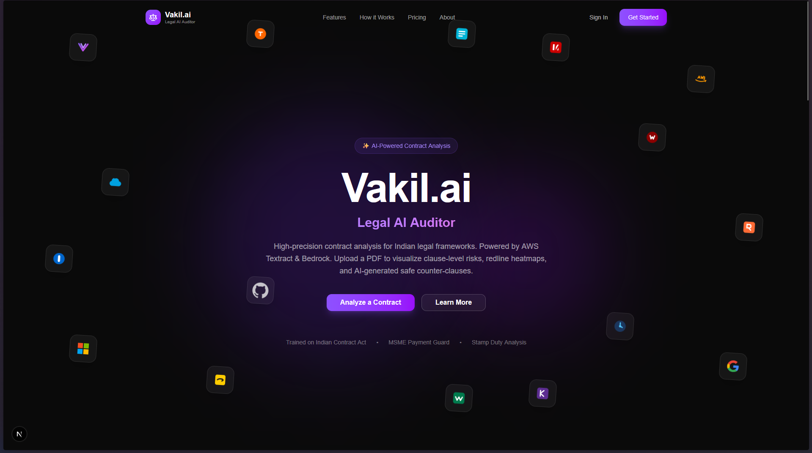
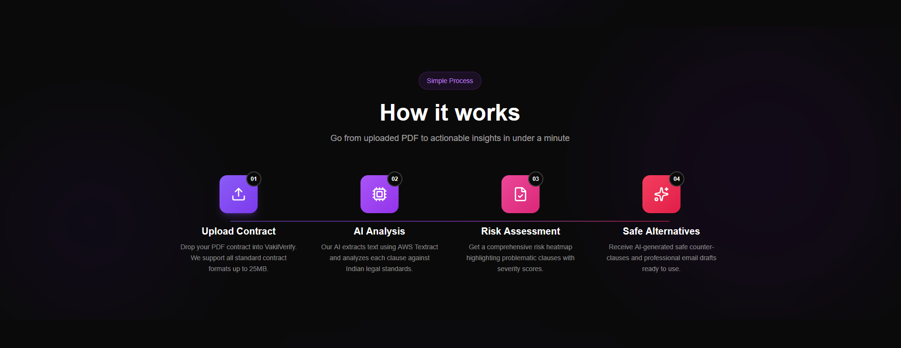
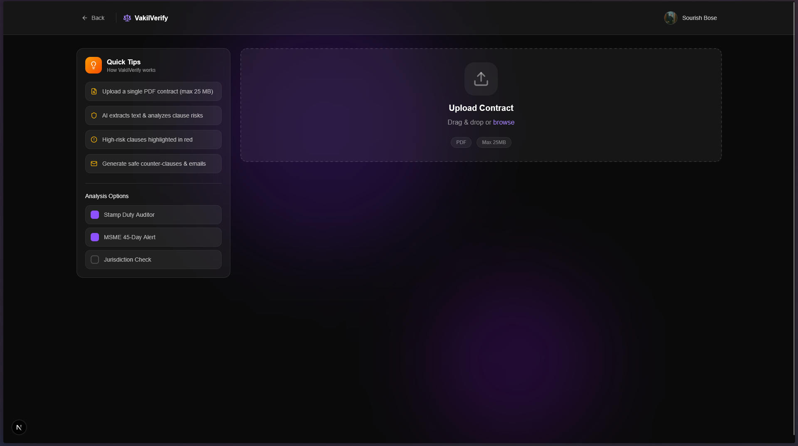
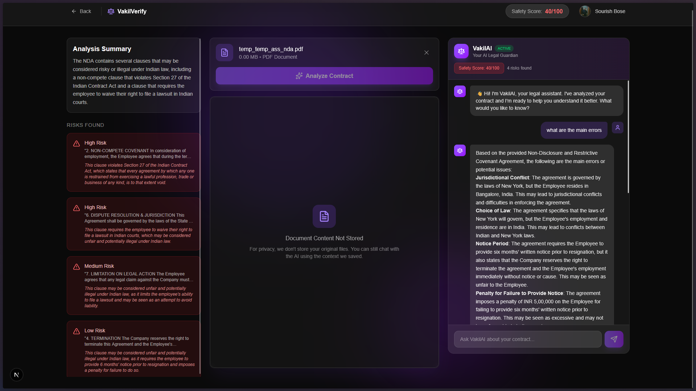
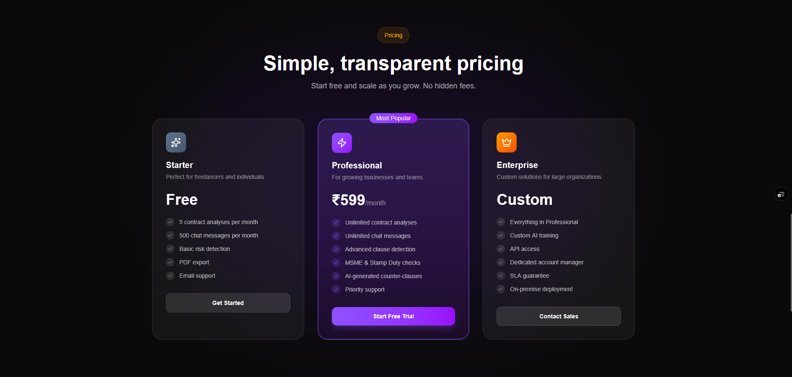

# ⚖️ VakilAI - AI-Powered Legal Assistant

  
<strong>Democratizing Legal Understanding with Privacy-First AI</strong>

  
  

---

## 🚀 Overview

**VakilAI** is your 24/7 personal legal guardian. We use advanced AI to analyze complex contracts, highlight risks, and answer your legal questions in plain English—all while keeping your data 100% private.

Whether you're a freelancer checking an NDA or a startup founder reviewing a Service Agreement, VakilAI ensures you **never sign blindly**.

---

## ⚙️ How It Works (RAG Pipeline)

VakilAI uses a sophisticated **Retrieval-Augmented Generation (RAG)** pipeline to ensure accuracy:

1.  **Extraction**: The uploaded PDF is processed in-memory to extract text, while maintaining document structure.
2.  **Vectorization**: The text is chunked and converted into vector embeddings using a specialized legal embedding model.
3.  **Knowledge Verification**: When you ask a question, we first retrieve the most relevant chunks from your specific document.
4.  **AI Analysis**: These chunks are fed into the LLM (Llama 3 via Groq) along with your query. The AI acts as a legal expert, analyzing *only* the retrieving context to generate a precise answer.
    *   *Result*: Zero hallucinations, and answers grounded strictly in your document's facts.

---

## ✨ Features that Protect You

### 🔒 Privacy-First Architecture
We believe your documents belong to you.
*   **No Storage**: We do not store your original PDF files.
*   **Ephemeral Analysis**: Documents are processed in memory and discarded immediately after extracting necessary insights.
*   **Secure Proxy**: All communication is encrypted and routed through secure internal layers.

### 📄 Intelligent Risk Detection
Upload any legal PDF, and our AI instantly scans for:
*   Risks & Loopholes
*   Missing Clauses
*   Unfair Terms (e.g., Non-Competes)
*   **Score**: Get a safety score (0-100) for every document.

### 💬 Talk to Your Lawyer & Manage Sessions
Don't understand a "Termination for Convenience" clause? Just ask.
*   **Context-Aware**: The AI knows *exactly* what's in your specific document.
*   **Persistent Sessions**: Your chat history and analysis reports are securely stored in our **Neon PostgreSQL** database. You can revisit past contract analyses at any time from your profile.
*   **Plain English**: No legalese. Just simple answers.

### 📊 Free & Pro Tiers
*   **Free**: Summarize up to 5 documents/month.
*   **Pro**: Unlimited analysis, deeper insights, and priority support.
Choose the plan that fits your needs. Get professional legal analysis for a fraction of the cost.

---

## 🛠️ Tech Stack

*   **Frontend**: Next.js 15, React, TailwindCSS, Framer Motion
*   **Backend**: Python, FastAPI
*   **AI Engine**: LangChain, Groq (Llama 3), ChromaDB (Vector Search)
*   **Database**: PostgreSQL (Neon), Drizzle ORM
*   **Auth**: Better-Auth (Secure Session Management)

---

  
Made with ❤️ for a fairer legal world.

